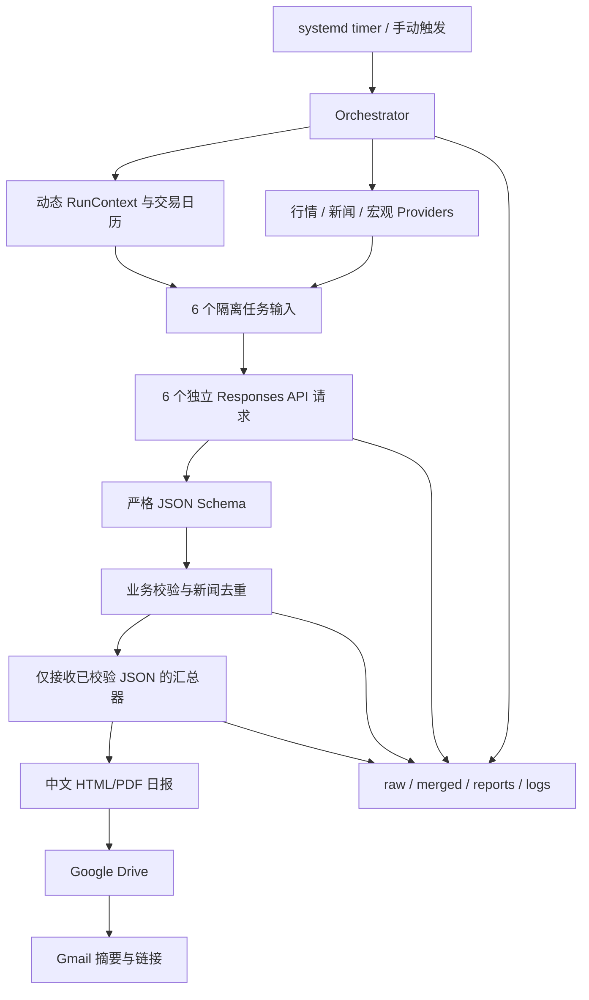

# 自动化金融日报系统：第一阶段架构与需求确认

状态：关键项已于 2026-08-18 确认，可进入第二阶段  
基准时区：`Asia/Hong_Kong`  
输入依据：`8_12 daily r.docx`

## 1. 附件检查结论

附件包含 6 个研究板块。实现时每个板块使用独立的 OpenAI Responses API 请求，彼此不共享消息、模型响应或会话标识。

| 任务 ID | 板块 | 标的或范围 | 附件要求的重点 |
|---|---|---|---|
| `hk_equities` | 港股 | 赣锋锂业 `1772.HK`；剑桥科技/CIG Shanghai `6166.HK`，参考 A 股 `002460.SZ`、`603083.SS` | 港股最近交易日收盘、涨跌幅、公司新闻、锂产业链、AI 光模块 |
| `us_semis_optics` | 美股半导体与光通信 | `MU`、`COHR` | 最近两个交易日、盘前盘后异动、HBM/存储、光模块与数据中心 |
| `us_platform_media` | 美股平台与媒体 | `GOOG`、`DJT` | Alphabet 跌因、AI/云/反垄断；DJT 加密资产、Truth Social、政治与融资动态 |
| `cross_asset` | 加密与能源 | `BTC/USDT`、WTI | BTC 24/30 小时表现、ETF/监管/链上；WTI 最近结算、OPEC+/库存/地缘政治 |
| `cybersecurity` | 网络安全 | `CRWD` | 最近两个交易日、盘前盘后异动、财报、产品、评级、行业事件与同业动态 |
| `macro_market` | 宏观、估值与情绪 | 美联储、宏观数据、NASDAQ/SOX、S&P 500、NDX、VIX 等 | 数据发布与预期、指数表现、估值、SOX/NDX 相对强弱、情绪指标 |

附件中的具体日期、价格、时间窗口和搜索词示例仅代表当日运行输入，不进入长期提示词或静态配置。程序在每次运行时生成 `run_context`，其中包含时区、截止时间、滚动窗口、各市场最近交易日及上一交易日。

安全发现：附件中出现了明文 Marketaux API 凭据。该凭据不得迁移到代码、配置、提示词、报告或日志；在接入真实 API 前应先撤销并轮换，新凭据仅保存于 AWS Secrets Manager。本项目也应配置日志脱敏和提交前密钥扫描。

## 2. 建议的任务边界

每个任务只接收以下内容：

1. 公共规则的版本化文本；
2. 当前板块的参数化配置；
3. 本次动态生成的 `run_context`；
4. provider 返回的、与本板块相关的候选行情和新闻数据。

每个任务均创建全新的 Responses API 请求，不复用 `previous_response_id`，不传入其他板块结果。任务可以并发执行，单个任务超时或失败不会取消其他任务。

汇总器不调用搜索、行情、新闻或宏观 provider，也不调用可联网的研究工具。它只读取已经通过 Pydantic/JSON Schema 与业务校验的板块 JSON；失败任务以结构化错误占位进入报告。

## 3. 配置分层

| 层级 | 建议位置 | 内容 | 是否每日变化 |
|---|---|---|---|
| 公共规则 | `app/prompts/common_rules.md` | 禁止编造、引用要求、时间语义、中文输出、证据约束 | 否，版本化 |
| 板块配置 | `app/modules/*.yaml` | 任务 ID、标的、主题、阈值、provider 路由、板块模板 | 否，版本化 |
| 每日参数 | 运行时生成，落盘为 `run_context.json` | `run_id`、HKT 截止时间、UTC 窗口、交易日、上一交易日 | 是 |
| 密钥 | AWS Secrets Manager | OpenAI、行情、新闻、Google OAuth/服务账号凭据 | 运行时读取，不落盘 |

配置文件只保存 Secrets Manager 的 secret 名称或 ARN，不保存 secret value。开发环境通过未提交的环境变量或本地 secret 注入，模拟模式不需要任何密钥。

## 4. 统一结构化输出契约

所有板块输出同一个顶层模型 `ResearchTaskResult`；不同板块的差异放在类型明确的数组中，不允许附带自由文本响应。

```text
ResearchTaskResult
├── schema_version: string
├── run_id: string
├── task_id: enum
├── status: success | partial | failed
├── window: {timezone, start_at, end_at}
├── instruments[]
│   ├── instrument_id, symbol, name, asset_class, exchange, currency
│   ├── market_session: {as_of, trading_date, session}
│   ├── prices[]: {kind, value, currency, as_of, change_value, change_pct, source_ids[]}
│   └── news[]: {headline, published_at, summary_zh, impact, rationale_zh, source_ids[]}
├── macro_observations[]: {metric_id, label, value, unit, period, actual, consensus, prior, source_ids[]}
├── relative_metrics[]: {metric_id, numerator, denominator, observations[], interpretation_zh, source_ids[]}
├── sources[]: {source_id, provider, publisher, url, published_at, retrieved_at}
├── no_major_news[]: {instrument_id, checked_at, reason_zh}
├── warnings[]: {code, message_zh, field_path}
└── errors[]: {code, stage, message_zh, retryable}
```

Responses API 使用严格 JSON Schema：`strict: true`、所有对象 `additionalProperties: false`、必填字段完整列出。响应无法解析或不符合 schema 时视为该任务失败；允许一次使用同一输入的受控重试，但不得把无效自由文本交给汇总器。

## 5. 程序校验

模型输出通过结构校验后，必须继续经过确定性业务校验：

- 标的代码：按 canonical instrument registry 校验代码、交易所、资产类别和别名；模型不能新增未配置标的。
- 日期与时间：统一解析为带时区 ISO 8601；新闻发布时间必须落入研究窗口，窗口外背景必须显式标记。
- 交易日：使用交易所日历计算 HKEX、NYSE/NASDAQ 最近交易日和上一交易日；周末和休市日不靠提示词推断。
- 价格：由行情 provider 的原始响应重新核验；收盘价、结算价、最新价和盘前盘后价不得混用。
- 涨跌幅：程序按价格重新计算，和来源值比较；超出容差则标记冲突，不采用模型计算值。
- 新闻来源：URL 规范化，限制为 `http/https`，记录抓取时间；标题、发布时间与标的关联均需校验。
- 重复新闻：先按 canonical URL 去重，再用规范化标题、发布时间和相似度合并转载；保留最原始或信誉优先来源。
- 引用完整性：每个价格、新闻和宏观数值至少引用一个存在于 `sources` 的 `source_id`。
- 失败隔离：校验失败的数据项可被剔除并形成 warning；无法形成可信板块结果时将板块标为 `failed`。

原始 provider 响应与 OpenAI 原始 JSON 分开保存。日志不得记录 Authorization 头、查询参数中的 token、secret value 或完整 OAuth 凭据。

## 6. Provider 接口

建议以可替换协议隔离供应商：

- `MarketDataProvider`：历史日线、最新价、盘前盘后、期货结算、指数数据。
- `NewsProvider`：按标的、关键词和时间窗口返回候选新闻。
- `MacroDataProvider`：宏观日历、实际/预期/前值、利率预期、估值与情绪指标。
- `TradingCalendarProvider`：交易所时区、开闭市与交易日计算。

第二阶段提供 `Mock*Provider`。第三阶段再选择真实供应商并通过配置路由；Yahoo Finance 网页最多作为辅助核对源，不作为唯一行情源，也不作为核心网页抓取依赖。

## 7. 总体架构



建议单次运行目录：

```text
data/runs/<run_id>/
├── run_context.json
├── raw/providers/<task_id>/...
├── raw/openai/<task_id>.json
├── validated/<task_id>.json
├── merged/report_input.json
├── reports/daily-report.html
├── reports/daily-report.pdf
├── delivery/drive.json
├── delivery/gmail.json
└── logs/run.jsonl
```

## 8. 代码与部署结构

```text
app/
├── orchestrator/     # 调度、并发、重试、状态机、run manifest
├── modules/          # 每个研究板块的 YAML 配置与注册表
├── prompts/          # 公共规则与参数化板块模板
├── providers/        # 行情、新闻、宏观、交易日历接口及实现
├── schemas/          # Pydantic 模型与导出的 JSON Schema
├── validators/       # 价格、时间、代码、URL、引用与去重
├── reporting/        # 仅从 validated JSON 生成日报
├── integrations/     # OpenAI、Drive、Gmail、Secrets Manager
├── cli.py            # run、validate、healthcheck 等命令
└── settings.py       # 非秘密配置加载
tests/
├── unit/
├── integration/
├── contract/
└── fixtures/
deploy/
├── Dockerfile
├── compose.yaml
├── systemd/daily-report.service
├── systemd/daily-report.timer
├── aws/iam-policy.json
└── aws/README.md
```

## 9. 运行、健康检查与故障策略

- 每天 `08:15 Asia/Hong_Kong` 启动，包括周末与节假日；休市市场使用程序计算的最近交易日。
- systemd timer 使用服务器本地时区或 timer 的 `Timezone=Asia/Hong_Kong`，并启用 `Persistent=true` 补跑错过任务。
- 容器健康检查只检查进程、配置可加载、数据目录可写；外部服务连通性放入 readiness/诊断命令，避免短暂网络波动导致容器重启循环。
- 单任务设置超时、有限指数退避和最大尝试次数；失败后写入结构化错误并继续。
- Drive 上传成功后才发送邮件；邮件发送前支持 `DRY_RUN`，测试环境默认不允许真实投递。
- 运行级退出状态区分 `success`、`partial_success`、`failed`；只要至少一个板块成功，就生成带失败说明的日报。
- 同一 `run_id` 幂等：重复执行不重复发信，除非显式指定重新投递。
- 生产环境只在运行期间使用本地暂存目录。raw JSON、validated JSON、合并结果、HTML、PDF 和日志全部上传 Drive 并校验成功后，删除该次本地运行目录；上传失败则保留本地文件以便重试。第二阶段尚未接入 Drive，测试产物保留在本地并可由测试清理。

## 10. 分阶段实施与验收

### 第二阶段：本地模拟最小版本

- 建立 Python 项目、Pydantic schema、6 个 YAML 板块配置、动态时间/交易日逻辑。
- Mock 行情、新闻、宏观与 OpenAI 客户端，验证 6 个隔离请求和失败隔离。
- 生成本地 HTML/PDF 报告，保留 raw、validated、merged、report、JSONL 日志。
- 单元测试覆盖 schema、动态日期、价格计算、URL/代码校验、去重、失败占位和汇总器无外部访问。
- 验收：无任何 API key 即可一条命令完整运行，故意令一个板块失败时仍生成日报。

### 第三阶段：真实研究与数据 API

- 接入 OpenAI Responses API 严格结构化输出。
- 接入选定的主行情、新闻和宏观 provider，并实现 fallback/交叉核验策略。
- 接入 AWS Secrets Manager，增加日志脱敏、请求审计、配额与成本保护。
- 验收：真实运行产出 6 份 schema-valid JSON，所有关键数字和新闻均通过程序校验。

### 第四阶段：Google Drive 与 Gmail

- OAuth 或服务账号接入 Drive，上传报告并配置共享权限。
- Gmail 发送中文摘要和 Drive 链接，加入允许名单、dry-run 和幂等投递记录。
- 验收：先上传至测试目录；测试邮件只发往用户明确批准的地址。

### 第五阶段：AWS EC2 部署

- 提供最小权限 IAM policy、Docker 镜像、持久化目录、systemd service/timer、健康检查和运维文档。
- 在目标 EC2 上部署，验证时区、Secrets Manager、磁盘权限、重启恢复和日志轮转。
- 手动执行一次完整 dry-run；只有收到明确许可后才进行真实 Gmail 投递。
- 验收：EC2 重启后 timer 仍有效，运行产物齐全，单板块失败不会阻断报告。

GitHub 与 EC2 的写操作在后续阶段单独执行。默认使用 `codex/` 前缀开发分支，不把附件中的凭据提交到 Git 历史。

## 11. 已确认的运行决策

1. 每天 `08:15 Asia/Hong_Kong` 运行，包括周末和节假日；休市市场使用最近交易日。
2. `6166.HK` 作为 CIG Shanghai/剑桥科技 H 股；Alphabet 使用 `GOOG`。
3. BTC 权威报价使用 Binance `BTC/USDT`。
4. WTI 使用 NYMEX `CL` 近月合约官方结算价，`MCL` 仅作为微型合约映射。
5. 报告输出为 HTML、PDF 和 JSON，不生成 DOCX。
6. 生产环境不做固定天数的本地留存；所有要求保存的产物上传并验证 Drive 后清理本地副本。
7. 当前没有付费行情、新闻或宏观 API 订阅。第二阶段全部使用 mock，不产生 API 费用。

Google 身份、Drive 文件夹、共享范围、Gmail 发件账号和收件人允许名单留到第四阶段确认。在用户明确批准真实收件人前，邮件集成始终使用 dry-run。

## 12. 第三阶段数据源与成本预估

以下为 2026-08-18 查询到的公开价格，均按月付估算，实际税费、汇率、商业授权和交易所许可另计。

### 推荐的起步组合

| 项目 | 建议供应商 | 起步费用 | 用途与限制 |
|---|---|---:|---|
| 全球日线行情 | [EODHD EOD Historical Data - All World](https://eodhd.com/pricing) | `US$19.99/月` | 用于港股、美股、指数最近交易日和历史日线；100,000 calls/day。第三阶段需实测 `6166.HK`、SOX、NDX 和 CL 合约覆盖情况。 |
| 新闻 | [Marketaux](https://www.marketaux.com/pricing) | `US$0/月` 起 | 免费档 100 requests/day、每次 3 篇；本项目预计可先运行。新闻不足时升至 `US$29/月`，2,500 requests/day、每次 20 篇。 |
| BTC | Binance public market-data API | `US$0` | 无需密钥的公共行情端点；需做限流与可用性 fallback。 |
| 宏观官方数据 | FRED、BLS、EIA 等官方 API | `US$0` | CPI、利率、能源库存等；部分需要免费注册 key。 |
| Google Drive/Gmail API | Google API 免费配额 | 通常 `US$0` | 受用户 Drive 容量与 Gmail 配额限制。 |
| AWS Secrets Manager | AWS | 约 `US$0.40/secret/月`，另加少量 API 调用费 | 若保存 4-5 个 secrets，通常约 `US$1.60-2.00/月`；EC2 费用不计，因为已有实例。 |

用户已确认第三阶段先采用免费优先模式：Marketaux 免费档用于新闻，Binance 与公开宏观官方 API 用于其覆盖的数据；暂不购买 EODHD。Marketaux 不提供完整行情，因此港股、美股、指数与 WTI 将接入多个免费 provider 并交叉核验。免费源无法可靠取得的数据必须明确标记缺失，不得用模型补造。只有完成第三阶段覆盖率报告并获得用户另行批准后，才允许购买付费数据。

免费 provider 的首选来源按原附件执行：

- 港股、美股、指数和 WTI：Yahoo Finance、Google Finance、Investing.com 作为相互独立的核验来源；Yahoo 不得成为唯一来源。
- BTC：Binance `BTC/USDT` 为权威报价，CoinGecko 等公开来源用于交叉核验。
- 新闻：Marketaux 免费 API 加独立 WebSearch；公司公告和监管机构页面优先于媒体转载。
- 宏观与情绪：FRED、BLS、EIA 等官方免费接口，并按附件尝试 CME FedWatch、Yardeni、multpl、WSJ、CNN Fear & Greed、AAII 等公开页面。
- 所有网页来源通过可替换 provider 适配，不把抓取逻辑写入板块 prompt；记录 URL、抓取时间和失败原因。

第三阶段先输出免费来源覆盖率与稳定性报告。只有免费来源持续无法满足具体字段时，才提出针对该字段的付费选项，未经用户确认不得订阅。

免费优先模式的固定数据订阅成本为 **US$0/月**；仍会产生 OpenAI token 和少量 AWS Secrets Manager 费用。

### OpenAI Responses API

[OpenAI 官方 API 定价](https://developers.openai.com/api/docs/pricing)按 token 计费，Responses API 本身不另收费。2026-08-18 的短上下文标准价：

| 模型 | 输入 / 1M tokens | 缓存输入 / 1M | 输出 / 1M | 本项目建议 |
|---|---:|---:|---:|---|
| `gpt-5.6-luna` | `US$0.20` | `US$0.02` | `US$1.20` | 默认执行 6 个结构化研究任务，先以质量评测决定是否足够 |
| `gpt-5.6-terra` | `US$2.00` | `US$0.20` | `US$12.00` | 对宏观板块或 Luna 失败任务升级重试 |
| `gpt-5.6-sol` | `US$5.00` | `US$0.50` | `US$30.00` | 不建议作为每日默认，仅用于人工触发的高难度复核 |

若每日 6 个任务合计约 120,000 输入 tokens、24,000 输出 tokens：

- 全部 Luna：约 `US$0.053/天`，约 `US$1.60/月`；
- 全部 Terra：约 `US$0.528/天`，约 `US$15.84/月`；
- 推荐混合路由的现实预算：约 `US$3-10/月`。

如让每个任务使用 OpenAI 内置 web search，官方价格为 `US$10/1,000 calls`，另计搜索内容 token。按每日约 12-30 次搜索，工具调用费约 `US$3.60-9.00/月`，但第三阶段优先由新闻 provider 提供候选资料，以降低模型搜索成本并增强可校验性。

### 暂不建议购买的高成本数据

- CME 官方实时/结算数据可能涉及专业市场数据授权和供应商许可，通常不是简单的低价公共 API 套餐。第三阶段先测试 EODHD 对 CL 近月与结算字段的覆盖；若不能满足“官方结算价”，再单独询价 CME 或授权供应商。
- FactSet 等机构级 NTM PE、分析师一致预期和指数估值通常为企业询价，成本可能远高于整个日报系统。起步阶段优先采用公开的带日期估值来源；无法取得 SOX 精确 PB/NTM PE 时，按附件要求明确标记“未能获取精确数据”，不得估造。
- EODHD `ALL-IN-ONE` 为 `US$99.99/月`，包含更多基本面、宏观、日历和新闻功能。只有在低价组合覆盖不足并通过第三阶段对比测试后才升级。

建议先设第三阶段月度成本上限为 **US$60**（EODHD `19.99` + Marketaux 最多 `29` + OpenAI 约 `3-10`）。CME 或企业级估值数据不纳入该上限，必须另行确认后才购买。
